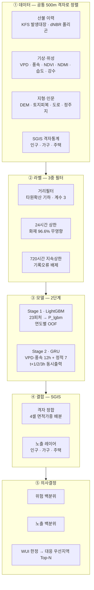

<div align="center">

# 산불先지도

**전국 500m 격자의 향후 1~3시간 산불 발화 위험을 AI로 예측하고,
SGIS 인구·가구·주택 격자통계를 결합해
"어디가 위험한가"를 넘어 **"어디를 먼저 지킬 것인가"** 를 알려주는 공간의사결정 시스템**

[작동 원리](#작동-원리) · [핵심 설계 판단](#핵심-설계-판단-5가지) · [성능](#성능) · [데이터 출처](#데이터-출처) · [저장소 구조](#저장소-구조)


**2026 제8회 SGIS 활용 우수사례 공모전 출품 준비**

</div>

---

## 무엇을 푸는가

산불 위험지도는 이미 있다. 산림청 국가산불정보시스템은 실시간 발생정보·위험등급·진화자원을 제공하고,
NASA FIRMS는 위성으로 이미 난 불을 탐지한다.

**빠져 있는 것은 "그래서 어디를 먼저 대응할 것인가"다.**

위험도가 높은 격자가 전국에 수천 개 나와도, 그중 어디에 사람이 살고 집이 있는지를 함께 보지 않으면
대응 순서를 정할 수 없다. 이 시스템은 그 연결을 만든다.

```
FORECAST          EXPOSE                  PRIORITIZE
1~3시간 발화위험  →  SGIS 인구·가구·주택  →  대응 우선지역
```

**효과 실측** — 2025-03-22 12:00 기준, 위험도만으로 상위 20개 격자를 고르면 노출인구가 5,429명이다.
같은 시각에 위험·노출을 함께 보면 **54,974명**이 된다. 같은 20개를 고르는데 **10배**를 커버한다.

---

## 규모

| 항목 | 실측값 |
|---|---|
| 분석 격자 | EPSG:5179 · 500m · 2130 × 2123 · 유효 **403,385셀** |
| 산불 사건 | 2021~2025년 2~6월 · **1,734건** |
| 화재 라벨 | 화재 셀 **2,090개** → 셀×시각 **17,085행** (24h 상한) |
| SGIS 격자통계 | 인구·가구·주택 500m 격자 · 2024 기준 |
| 노출 배분 | 총인구 **51,637,925명** (원본 51,911,890명의 99.47%) |
| 지오코딩 복구 | **414/417건 (99.3%)** · 누락 피해면적의 **100.00%** |
| 예측 격자 | 전국 403,385셀 × t+1h/t+2h/t+3h |

---

## 작동 원리



---

## 핵심 설계 판단 5가지

### ① 예측 대상을 "지속"이 아니라 "신규 발화"로 재정의했다

기존 모델의 라벨을 감사한 결과, `label_t1/t2/t3` 양성의 **100%가 이미 화재 중이던 픽셀**이었다.
전국 무작위 음성 샘플링만으로는 "발화 3시간 전 그 픽셀"이 뽑힐 확률이 0에 가깝기 때문이다.

| horizon | 양성 | t 시점 미발화 | 실제 신규발화 |
|---|---|---|---|
| t+1h | 4,425 | **0.00%** | 0.02% |
| t+2h | 3,378 | **0.00%** | 0.06% |
| t+3h | 2,628 | **0.00%** | 0.11% |

→ 발화 직전 T-1/-2/-3h 마커를 명시적으로 추가해 **신규 발화 예측**으로 전환했다.
검증 스크립트: [`20_label_audit_new_ignition.py`](scripts/20_label_audit_new_ignition.py)

### ② SGIS 지오코딩 API로 누락된 산불의 23%를 복구했다

원본 산불대장 1,801건 중 **417건(23.2%)** 이 지오코딩 실패로 좌표가 없어 학습에서 통째로 빠져 있었다.
그 417건의 피해면적 합계가 **19,633ha — 전체의 56.8%** 이며,
여기에 **2022 울진·삼척 산불(16,302ha)** 이 포함된다. 즉 모델은 기록상 최대 산불을 본 적이 없었다.

SGIS `addr/stage.json`으로 시도→시군구→읍면동 정식명 계층(252개 시군구)을 만들고
축약 주소(`경북 의성 금성 청로`)를 정식 주소(`경상북도 의성군 금성면 청로리`)로 복원해 지오코딩했다.

**414/417건(99.3%) 복구, 누락 피해면적의 100.00% 회수.** 소요 6초.

### ③ SGIS 격자와 분석 격자는 정렬돼 있지 않다 — 면적가중으로 결합했다

좌표계(EPSG:5179)와 셀 크기(500m)가 같아도 **원점이 어긋나 있다.**

```
분석격자 원점  x = 414341.43   (500으로 나눈 나머지 341.43)
               y = 2269364.07  (나머지 364.07)
```

분석 격자 셀 하나가 SGIS 셀 **4개**에 걸치며, 어긋난 양이 전 격자에서 같아 배분 가중치가 상수다.

```
        SGIS 셀 4개로 배분
        ┌─────────┬─────────┐
        │  8.62%  │ 18.56%  │
        ├─────────┼─────────┤
        │ 23.09%  │ 49.72%  │
        └─────────┴─────────┘
```

SGIS 격자경계 API로 강릉시·문경시·강남구 격자 꼭짓점을 실측해 500 배수 정렬을 확인했고,
배포 SHP 418,728셀에서도 재확인했다. 마스크가 필요로 하는 셀의 **99.52%** 를 커버한다.

### ④ 라벨 래스터화는 "교차하면 1"이 아니라 "셀 중심 포함"이다

dNBR 폴리곤은 잘게 파편화돼 있다(울진 426개 중 92.7%가 25ha 미만).
`all_touched=True`로 래스터화하면 1ha 조각도 500m 셀(25ha)을 통째로 차지한다.

| 규칙 | 격자화 면적 | 실면적(19,946ha) 대비 |
|---|---|---|
| all_touched=True | 81,875ha | **4.10배 과대** |
| **셀 중심 포함 (채택)** | 19,675ha | **0.99배** |
| 면적비율 ≥ 0.25 | 29,400ha | 1.47배 |
| 면적비율 ≥ 0.50 | 15,500ha | 0.78배 |

검증: [`40b_rasterize_rule_compare.py`](scripts/40b_rasterize_rule_compare.py)

### ⑤ 확률이라 부르지 않고 백분위로 제시한다

학습 시 1:10 재표본화를 쓰므로 sigmoid 출력은 실제 발생확률이 아니다
(전국 평균이 0.13에 달한다). 서비스·보고서 모두 **전국 상대 백분위**로만 표현하고,
대응 우선순위도 임의의 곱셈식 대신 **두 백분위의 평균**으로 정의해 단위 문제와 가중치 불투명성을 피했다.

---

## 성능

> 2026-09-01 확정. 학습 데이터셋 재구축(지오코딩 복구분 + 720h 지속시간 상한) 반영 완료.

### 신규발화 GRU — 연도별 leave-one-year-out 5-fold

| horizon | AUROC | AUPRC | 평균 기저율 | **기저율 대비 리프트** |
|---|---|---|---|---|
| t+1h | **0.837** | 0.142 | 2.97% | **5.15배** |
| t+2h | 0.826 | 0.127 | 2.96% | 4.57배 |
| t+3h | 0.807 | 0.115 | 2.96% | 4.06배 |

리프트는 fold별 기저율(1.94%~4.24%)로 각각 나눈 뒤 평균한 값이다. 기저율이 fold마다
다르므로 AUPRC 절대값을 fold 사이에서 직접 비교해서는 안 된다.

AUPRC 절대값이 낮아 보이지만 **기저율 대비 리프트는 기존 지속예측 모델(4.38배)을 웃돈다.**
차이의 대부분은 모델 성능이 아니라 문제의 희소성(9.08% → 2.97%)에서 온다.

### 대형산불 발화 직전 시점을 실제로 짚어내는가

발화 1시간 전 시점의 t+1h 점수가 해당 연도 테스트셋 안에서 차지하는 백분위:

| 산불 | 발화 | 피해면적 | 백분위 |
|---|---|---|---|
| 경북 울진 북 | 2022-03-04 11시 | 16,302 ha | 89.9% |
| 강원 강릉 옥계 | 2022-03-05 01시 | 4,190 ha | 80.9% |
| 경남 산청 시천 | 2025-03-21 15시 | 3,397 ha | 95.2% |
| 충남 홍성 서부 | 2023-04-02 11시 | 1,454 ha | 97.0% |
| 울산 울주 온양 | 2025-03-22 12시 | 931 ha | 99.7% |

피해규모가 클수록 순위가 올라간다 — 중앙 백분위가 `<0.5ha` 86.5% 에서 `500ha+` 97.0% 로
단조 증가한다. 즉 **모델이 놓치는 쪽은 대부분 소규모 산불**이다.

> ⚠️ 위 백분위는 **1:10 재표본화된 테스트셋 내부** 기준이다. 전국 격자 403,385개를 상대로 한
> 실전 순위는 이보다 낮으며, 전 기간 스캔(`51_daily_scan_full_period.py`) 결과로 별도 보고한다.

### 마커 보충 전후 — 최대 산불이 평가에 들어오자 약한 fold가 회복됐다

기존 학습셋은 화재 지속시간 72시간 상한 탓에 울진(222.7h)·산청(532.6h)·강릉 옥계(155.9h)가
통째로 빠져 있었다. 383건(30,466 ha)을 보충한 결과:

| fold | AUROC 전 | AUROC 후 | 비고 |
|---|---|---|---|
| 2022 | 0.689 | **0.792** | 울진·강릉 옥계 편입 |
| 2023 | 0.772 | **0.839** | 홍성·금산 편입 |
| 2021 | 0.867 | 0.865 | — |
| 2024 | 0.833 | 0.841 | — |
| 2025 | 0.859 | 0.847 | — |
| **평균** | **0.796** | **0.823** | |

전체 리프트는 4.60배 → 4.59배로 사실상 변동이 없다. **개선분이 2022·2023에 몰려 있다는 점이
중요하다** — 그동안 이 두 해의 점수가 낮았던 것은 모델의 한계가 아니라 평가 대상에서
최대 산불이 빠져 있었기 때문이다.

threshold는 **validation에서 선정해 test에 고정 적용**한다.
기존 방식(test에서 F1 최대점 탐색)은 F1을 0.197 → 0.209로 부풀렸다.

### 하드네거티브 ablation — 효과 없음을 확인

발화지점 반경 1~10km 미발화 픽셀을 학습 음성에 늘려봤으나 성능이 단조 하락했다.

| 학습 음성 중 하드네거티브 | AUPRC | AUROC | CSI |
|---|---|---|---|
| 3.2% (무작위) | **0.1296** | **0.7821** | **0.1046** |
| 25.0% | 0.1235 | 0.7760 | 0.0957 |
| 50.0% | 0.1224 | 0.7737 | 0.0772 |

원인: 하드네거티브가 양성과 **구별되지 않는다.** GRU가 보는 7개 정적 피처 중 6개에서
표준화 평균차(Cohen's d)가 0에 가깝다. VPD·풍속·습도는 원본이 km 스케일이라
반경 10km 안에서 값이 거의 같기 때문이다.

| 피처 | 양성 vs 하드네거티브 | 양성 vs 배경음성 |
|---|---|---|
| hum4d | 0.002 | −0.901 |
| ndmi | 0.002 | −0.603 |
| vpd | 0.007 | 0.506 |
| P_lgbm | 0.272 | 0.379 |

### 사례 replay — 2025-03-22

전국 403,385격자를 13개 시각(06~18시)에 추론하는 데 **1.5분**.

| 피해규모 | 관측 | 위험백분위 중앙값 | 상위 5% 안 |
|---|---|---|---|
| 50ha 이상 | 9 | **4.7%** | 55.6% |
| 0.5ha 미만 | 36 | 36.0% | 8.3% |

피해면적(log)과 위험백분위 상관 **r = −0.457**. 큰 화재일수록 상위에 오는 경향은 있으나
5~50ha 구간이 경향을 벗어나며, **하루치 22개 사건이라 통계적 결론이 아니라 경향 관찰이다.**

---

## 데이터 출처

| 데이터 | 출처 | 이용 |
|---|---|---|
| 500m 격자통계 (인구·가구·주택) | 국가데이터처 SGIS 자료제공 | 무료 · 신청 후 다운로드 |
| 500m 격자경계 | 국가데이터처 SGIS 자료제공 | 무료 · SHP |
| 지오코딩 · 행정구역 · 역지오코딩 | SGIS OpenAPI | 무료 · 1일 5만 회 |
| 산불 발생대장 | 산림청 | 과제 내부 |
| dNBR 피해 폴리곤 | Sentinel-2 · Google Earth Engine | 과제 내부 |
| 기상 (VPD·풍속·습도·강수) | 기상청 | 과제 내부 |
| 식생 (NDVI·NDMI) | MODIS MOD09A1 | NASA |
| 지형·토지피복·도로·정주지 | 국토지리정보원 · 환경부 · 국토교통부 | 과제 내부 |

> SGIS 통계 비공개 처리 주의 — 인구부문은 값이 5 미만이면 0/5/8로 치환된다.
> 실제로 1~4 값이 존재하지 않으며, 침엽수 80% 이상 격자의 **71.7%** 가 이 구간에 속한다.
> 산불 위험지역일수록 저인구 격자라 개별 값의 상대오차가 크다. 보고서에 명시할 것.

---

## 저장소 구조

```
SGIS/
├── scripts/                     분석 파이프라인
│   ├── 20_label_audit_*.py        기존 라벨 감사 (지속 vs 신규발화)
│   ├── 21~25_*.py                 발화직전 마커 · 학습셋 · GRU 5-fold · ablation
│   ├── 22b_verify_sgis_grid_*.py  SGIS 격자 원점 실측 검증
│   ├── 26~29_*.py                 격자 대응표 · GRID_CD 매핑 · 노출 레이어
│   ├── 30~30c_recover_*.py        SGIS 지오코딩 복구 (3단계)
│   ├── 32_fullgrid_inference_*.py 전국 격자 추론
│   ├── 34_priority_final.py       대응 우선순위 (규칙 B + WUI)
│   ├── 35_case_replay.py          시간대별 사례 replay
│   └── 40~40b_*.py                화재 셀-시간 인덱스 · 래스터화 규칙 비교
├── docs/
│   ├── ARCHITECTURE.md            데이터 흐름 · 스크립트 의존관계
│   ├── METHODOLOGY.md             라벨 필터 · 격자 정합 · 우선순위 규칙
│   └── HANDOFF_geocode_recovery.md  지오코딩 복구 인계
├── outputs/                     성능 결과표 · 실행 로그
└── data/                        (미포함 — 원 권리는 각 제공기관)
    └── grid_data/derived/         결과표·파라미터만 공개
```

`data/`는 1.8GB이고 원 권리가 각 제공기관에 있어 포함하지 않는다.
SGIS 격자통계·격자경계는 [자료제공](https://sgis.mods.go.kr/view/pss/openDataIntrcn)에서 직접 신청하면 된다.
재현에 필요한 격자 정합 가중치·거리필터 로그·Top-N 결과표는 `data/grid_data/derived/`에 포함했다.

---

## 한계

1. **dNBR 폴리곤에 시간 정보가 없다.** 최종 누적 범위만 알 수 있어, 폴리곤 셀을 화재 초기 구간에 일괄 적용하는 것은 근사다.
2. **발화점 좌표가 GPS가 아니다.** 읍면동·리 수준 지오코딩이라 수 km 오차가 정상이며, 거리필터 5km 하한이 이를 흡수한다.
3. **`damagearea`는 최종 피해면적이 아니다.** 발화 신고시점 기록이다. 2025 의성 산불은 '금성 청로 57ha' 단일 레코드로만 존재한다.
4. **소형 화재 식별력이 낮다.** 테스트셋 기준 0.5ha 미만 화재의 백분위 중앙값은 86.5%로
   500ha 이상(97.0%)보다 뚜렷하게 낮다. 전국 격자 기준 수치는 전 기간 스캔 후 갱신한다.
5. **확률 보정 미완.** 재표본화 때문에 sigmoid 출력을 발생확률로 쓸 수 없다. 운영 단계에서 별도 calibration이 필요하다.
6. **연도별 편차.** 마커 보충으로 2022년 fold의 AUROC가 0.69 → 0.79로 회복돼 다른 해(0.79~0.87)와의
   격차가 줄었다. 남은 편차는 연도별 산불 건수·기저율 차이(1.94%~4.24%)에서 온다.
7. **늦겨울 양성 손실.** NDVI·NDMI 합성 결측으로 양성 1,733건 중 200건(11.5%)이 학습에서 탈락하며,
   2월 102건·3월 60건으로 **산불 성수기에 몰려 있다.** 다만 탈락분의 피해면적 합계는 698ha로 전체의
   약 2%이고, 상위 11개 대형산불은 모두 학습에 반영됐다. 기존 연구 파이프라인과 동일한 처리를 유지했다.

---

## 라이선스

코드는 [MIT](LICENSE). 수집·가공 데이터의 원 권리는 각 제공기관에 있으며 재이용 조건은 각 기관 고지를 따른다.
SGIS OpenAPI 인증키는 [API 이용약관](https://sgis.mods.go.kr/developer/html/newOpenApi/app/rules.html) 제4조에 따라
발급받은 자만 이용할 수 있고 타인과 공유할 수 없다.
