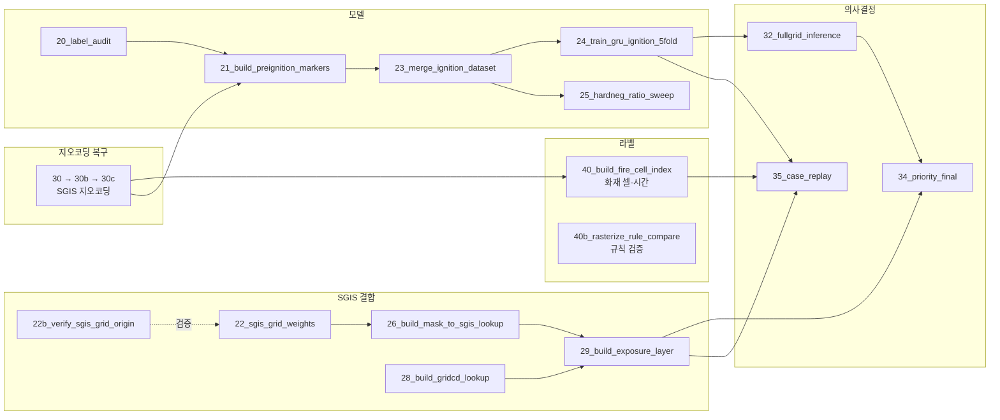

# 아키텍처

데이터가 어디서 와서 어떤 스크립트를 거쳐 무엇이 되는지, 그리고 무엇을 바꾸면 무엇이 다시 돌아야 하는지를 적는다.

---

## 1. 저장소 밖 데이터 위치

| 위치 | 내용 | 접근 |
|---|---|---|
| `V:\data\` (= `\\192.168.0.26\문화재청_하수범김동현\모델링\data`) | 기상·위성·지형 래스터, 공통 마스크, 산불 레퍼런스, LightGBM fold 모델 | **읽기 전용** |
| `C:\for_sgis\data\fire_reference\` | 위 NAS의 산불 레퍼런스 스냅샷 (2026-09-01 15:07) | 작업 사본 |
| `C:\for_sgis\data\grid_data\` | SGIS 자료제공 다운로드 원본 + `derived/` 산출물 | 로컬 |
| `C:\for_sgis\models\` | 학습된 GRU 가중치·스케일러 | 로컬 |

> **NAS는 절대 쓰지 않는다.** 가공이 필요하면 작업 폴더로 복사해서 처리한다.
> `fire_reference/`는 그래서 사본이며, 다른 세션이 NAS 원본을 재생성하는 중에도 안전하게 읽을 수 있다.

---

## 2. 공통 격자 — 모든 것의 기준

```
common_mask_500m_5179.tif
  CRS      EPSG:5179 (Korea 2000 Unified, UTM-K)
  크기     2130 행 × 2123 열
  해상도   500m
  원점     x = 414341.4294,  y = 2269364.0712
  유효셀   403,385개 (mask == 1)
```

기존 연구의 모든 피처 래스터가 이 마스크에 클립·정렬돼 있다. **격자는 바꿀 수 없다.**
외부 데이터(SGIS 등)는 전부 이쪽으로 끌어온다.

픽셀 인덱스 `(prow, pcol)` ↔ 좌표 변환:

```
x = 414341.4294 + 500 × (pcol + 0.5)
y = 2269364.0712 − 500 × (prow + 0.5)
```

---

## 3. 파이프라인 — 스크립트 의존관계



### 실행 순서 (처음부터 재구축할 때)

```bash
# ① SGIS 지오코딩 복구 — 다른 단계의 입력이 되므로 먼저
python scripts/30_recover_failed_geocodes.py
python scripts/30b_recover_remaining.py
python scripts/30c_recover_sigu.py

# ② 격자 정합 (SGIS 데이터 수령 후)
python scripts/22_sgis_grid_weights.py
python scripts/22b_verify_sgis_grid_origin.py     # 검증만, 산출물 없음
python scripts/26_build_mask_to_sgis_lookup.py
python scripts/28_build_gridcd_lookup.py
python scripts/29_build_exposure_layer.py

# ③ 화재 라벨
python scripts/40_build_fire_cell_index.py

# ④ 모델 (학습셋은 별도 준비 중)
python scripts/24_train_gru_ignition_5fold.py

# ⑤ 추론 · 의사결정
$env:TARGET_DT='2025-03-22 12:00'; python scripts/32_fullgrid_inference_ignition.py
$env:STAMP='20250322_1200';        python scripts/34_priority_final.py
$env:DATE='2025-03-22';            python scripts/35_case_replay.py
```

---

## 4. 스크립트별 입출력

| # | 스크립트 | 입력 | 출력 |
|---|---|---|---|
| 20 | `label_audit_new_ignition` | `seq_dataset_12h_multih_4v1.parquet` (NAS) | `label_audit_new_ignition.csv` |
| 21 | `build_preignition_markers` | NAS 래스터 전체 · 산불 이력 | `preignition_markers_raw.parquet` |
| 22 | `sgis_grid_weights` | 공통 마스크 | `sgis_grid_weights.json` |
| 22b | `verify_sgis_grid_origin` | SGIS 격자경계 API | (검증 출력만) |
| 23 | `merge_ignition_dataset` | 21번 산출 + LightGBM fold 모델 | `seq_dataset_ignition_multih.parquet` |
| 24 | `train_gru_ignition_5fold` | 23번 산출 | `models/gru_ign_*` · `gru_ignition_multih_{results,probs}.csv` |
| 25 | `hardneg_ratio_sweep` | 23번 산출 | `gru_ignition_hardneg_sweep.csv` |
| 26 | `build_mask_to_sgis_lookup` | 공통 마스크 | `mask_to_sgis_500m.parquet` (1,613,540행) |
| 28 | `build_gridcd_lookup` | SGIS 격자경계 SHP 30도엽 | `sgis_gridcd_500m.parquet` (418,728셀) |
| 29 | `build_exposure_layer` | SGIS 격자통계 CSV + 26 + 28 | `mask_exposure_500m.parquet` |
| 30/b/c | `recover_*` | 산불 이력 + SGIS 지오코딩 API | `fire_events_geocode_recovered.csv` |
| 32 | `fullgrid_inference_ignition` | NAS 래스터 + GRU 모델 | `hazard_ignition_{stamp}.parquet` |
| 34 | `priority_final` | 32 + 29 + 토지피복 | `priority_final_{stamp}.parquet` · Top-N · 민감도 |
| 35 | `case_replay` | 32와 동일 + 29 + 40 | `replay_{date}_{grid,summary,top}` |
| 40 | `build_fire_cell_index` | dNBR 폴리곤 + 산불 이력 + 30번 복구 | `fire_cells` · `fire_cell_hours` · 거리필터 로그 |
| 40b | `rasterize_rule_compare` | dNBR 폴리곤 | `rasterize_rule_compare.csv` |

---

## 5. 모델 구조

```
Stage 1 — LightGBM (기존 연구 산출물, V:\data\ml_results\...\lgbm_models\)
  입력  23피처 (지형 5 · 토지피복 6 · 인문 4 · 기상 4 · 식생 2 · 계절 2)
  출력  P_lgbm — 해당 시점 공간 취약도
  누수  연도별 OOF — 그 해를 학습에 쓰지 않은 fold 모델이 그 해를 예측

Stage 2 — GRU (본 저장소)
  시계열  VPD · 풍속 × 12시간            shape (batch, 12, 2)
  정적    P_lgbm · NDVI · NDMI · hum4d · prcp4d · doy_sin · doy_cos   (7)
  인코더  nn.GRU(2 → 64, num_layers=2, dropout=0.3)
  헤드    Linear(64+7 → 64) → ReLU → Dropout(0.3) → Linear(64 → 3) → Sigmoid
  출력    t+1h · t+2h · t+3h 동시
  학습    1:10 재표본화 · Adam lr=3e-4 · batch 2048 · 최대 100 epoch · patience 15
  검증    연도별 leave-one-year-out 5-fold, train의 random 20%를 val
```

**시각 규약** (반드시 지킬 것)

```
vpd_t0      = TARGET_DT − 1h  래스터
vpd_tm{k}   = TARGET_DT − (k+1)h  래스터        k = 1..11
예측 대상   = TARGET_DT + 1h / +2h / +3h
```

---

## 6. 무엇을 바꾸면 무엇이 다시 도는가

| 바뀐 것 | 다시 돌려야 하는 것 |
|---|---|
| 산불 이력 · 지오코딩 | 40 → (학습셋) → 24 → 32 → 34/35 |
| 라벨 규칙 (거리필터·24h·래스터화) | 40 → (학습셋) → 24 → 32 → 34/35 |
| SGIS 격자통계 갱신 | 29 → 34/35 |
| 공통 마스크 | **전부** (22 · 26 · 28 · 29 · 40 · 32 …) |
| GRU 가중치 | 32 → 34/35 |
| 우선순위 규칙 · WUI 기준 | 34만 |
| 추론 대상 시각 | 32 → 34, 또는 35 단독 |

모델 교체는 `models/`에 새 가중치를 넣고 32번의 파일명 상수만 바꾸면 된다.
32 → 34는 1분 이내, 35(하루 13시각)는 1.5분이다.

---

## 7. 성능 특성

| 작업 | 소요 | 병목 |
|---|---|---|
| 지오코딩 복구 414건 | 6초 | SGIS API |
| 격자 대응표 생성 | 20초 | 로컬 계산 |
| 노출 레이어 | 1분 | CSV 파싱 |
| GRU 5-fold 학습 | 6.4분 | CPU (20코어) |
| 전국 격자 추론 1시각 | 0.6분 | NAS 래스터 읽기 |
| 사례 replay 13시각 | 1.5분 | 래스터 캐시로 75개만 읽음 |
| 발화직전 마커 구축 | 3.5시간 | **NAS SMB 왕복지연** |

NAS 접근이 압도적 병목이다. 초당 약 31건밖에 처리하지 못한다.
점 단위 추출이 많은 작업(21·31번)은 파일 접근을 전역으로 합치고 16스레드로 병렬화했다.
전국 격자를 다 읽는 작업(32·35번)은 반대로 전체 배열 읽기가 유리하며,
35번은 인접 시각이 시계열 12랙 중 11개를 공유한다는 점을 이용해 캐시한다.

---

## 8. 인증

```
C:\for_sgis\.env          # .gitignore 처리됨
  SGIS_CONSUMER_KEY=...
  SGIS_CONSUMER_SECRET=...
```

| 용도 | 엔드포인트 |
|---|---|
| 인증 (AccessToken, 4시간) | `https://sgisapi.mods.go.kr/OpenAPI3/auth/authentication.json` |
| 지오코딩 | `.../OpenAPI3/addr/geocode.json` |
| 역지오코딩 | `.../OpenAPI3/addr/rgeocode.json` |
| 단계별 주소조회 | `.../OpenAPI3/addr/stage.json` |
| 격자경계 | `.../OpenAPI3/grid/data.geojson` |

`adm_cd`는 법정동코드가 아니라 **SGIS 자체 코드**다 (예: 강남구 = `11230`).
1일 5만 회 제한. 좌표 입출력은 EPSG:5179.
