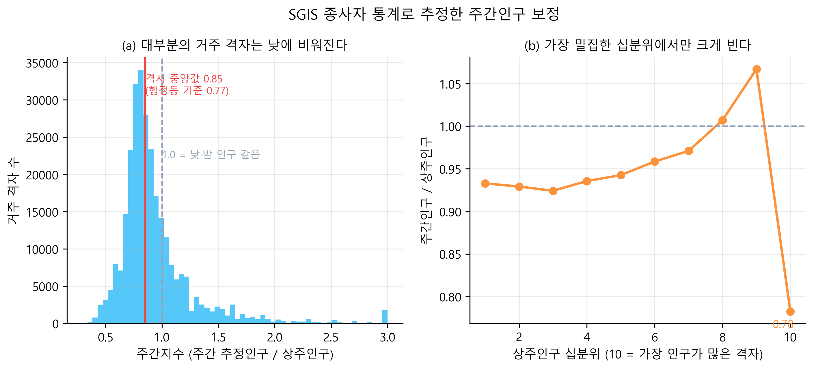
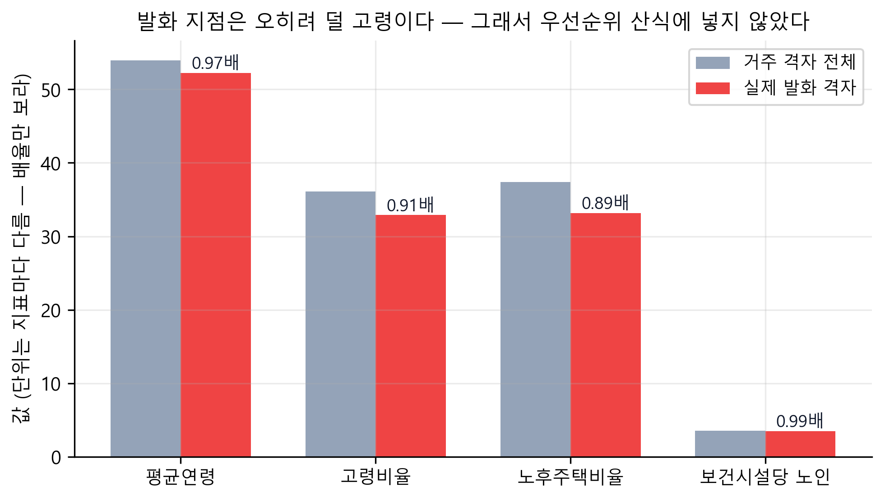
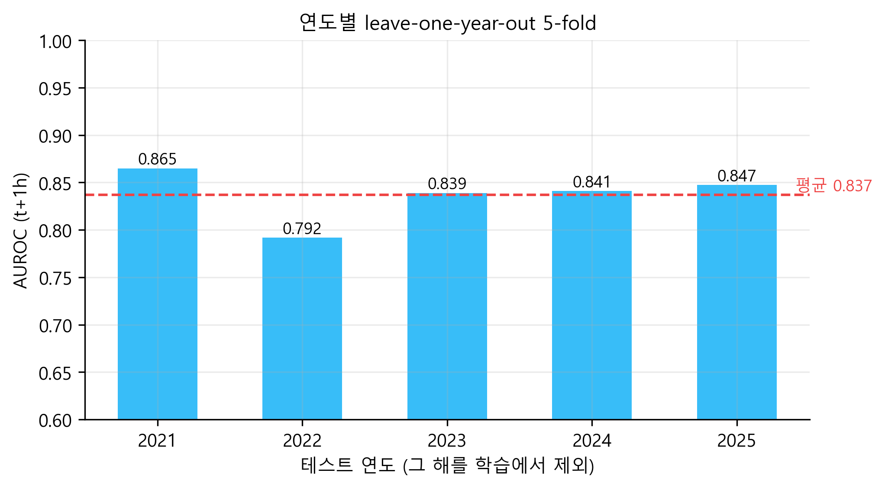
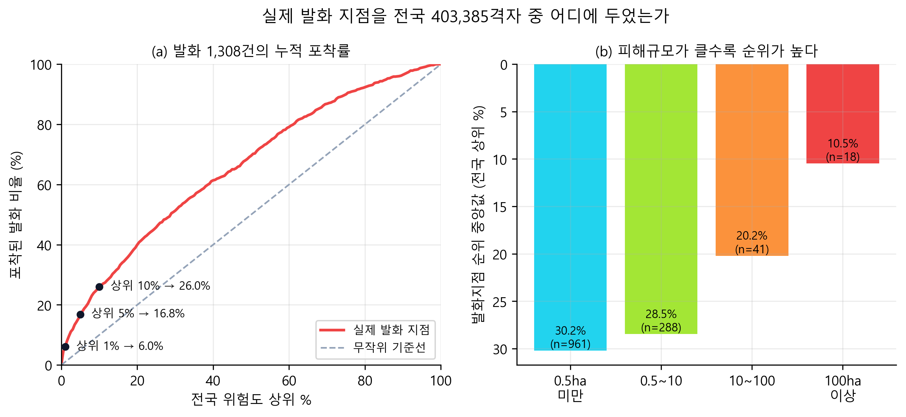
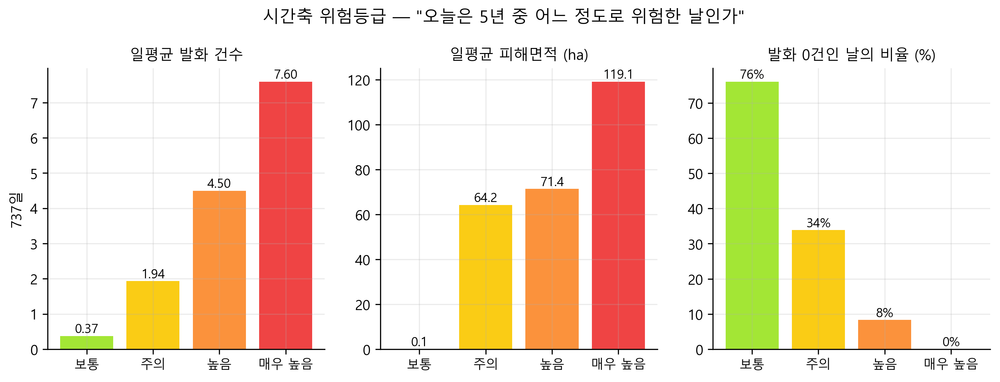
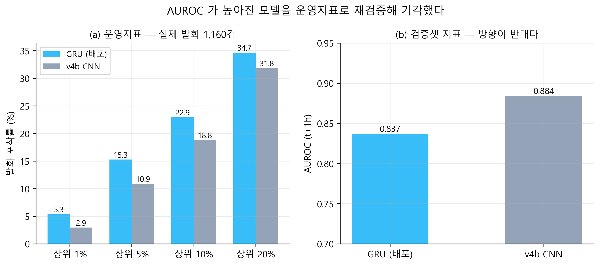
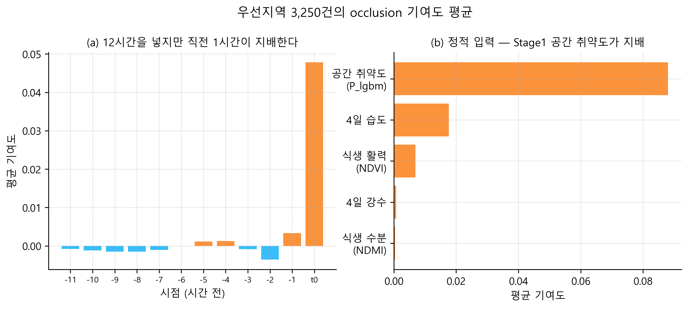

# 산불 발화예측·우선대응 통합지도
## SGIS 통계지리 기반 500m 격자 의사결정 시스템

> 제8회 SGIS 활용 우수사례 공모전 제출용 원고
> 데모 https://wildfire-predict-framework.vercel.app · 코드 https://github.com/tradeprogram/wildfire_predict_framework

---

## 1. 무엇을 푸는가

산불 대응의 실제 병목은 "불이 날까"가 아니라 **"한정된 헬기와 진화대를 어디에 먼저 보낼 것인가"** 다.
기존 산불위험지수는 전국을 시·군 단위 색으로 칠해 주지만, 그 색만으로는 출동 순서를 정할 수 없다.

이 시스템은 두 가지를 결합해 그 질문에 답한다.

| | |
|---|---|
| **AI 발화예측** | 전국 500m 격자 403,385개에 대해 향후 **t+1h·t+2h·t+3h** 신규 발화 위험을 산출 |
| **SGIS 통계지리** | 그 격자에 **낮에 몇 명이 있는지**, 그중 고령자·노후주택이 얼마인지를 결합 |

결과는 "위험한 곳"이 아니라 **"먼저 지켜야 할 곳"** 의 순위다.

---

## 2. SGIS를 어디에 썼는가

이 공모전의 기준으로 스스로에게 물었다 — **SGIS를 빼면 결과가 달라지는가?**
다섯 군데에서 달라진다.

### 2.1 500m 격자 정합 — 면적가중 배분

분석 격자(EPSG:5179, 500m)와 SGIS 격자통계는 정렬돼 있지 않다. 분석 셀 하나가 SGIS 셀 **4개**에 걸치며,
어긋난 양이 전 격자에서 같아 배분 가중치가 상수다. 이를 면적가중으로 배분해 총인구
**51,637,925명**(원본 51,911,890명의 99.47%)을 격자에 실었다.

SGIS 격자경계 API로 강릉시·문경시·강남구 격자 꼭짓점을 실측해 500 배수 정렬을 확인했고,
배포 SHP 418,728셀에서도 재확인했다.

### 2.2 지오코딩 복구 — 누락된 산불의 23%

산불 이력의 좌표 결측 417건을 SGIS 지오코딩 API의 3단계 조회(리 → 읍면동 → 시군구)로 복구했다.
이 복구분에 **2022년 울진 산불(16,302ha)을 포함한 최대 규모 사건들**이 들어 있었고,
복구 전 2022년 fold의 AUROC는 0.69였다가 복구 후 0.79로 회복됐다.

### 2.3 노출의 시간 불일치 교정 — 이 시스템의 핵심 기여

**산불은 오후에 몰린다.** 그래서 스캔 시각을 11·14시로 잡았다.
그런데 노출은 인구주택총조사 **상주인구**, 즉 "밤에 어디서 자는가"로 재고 있었다.
**낮에 예측하고 밤 인구로 피해를 셈하고 있었던 것이다.**

SGIS에 주간인구·통근 통계는 없다(`commute`, `daytimepopulation` 엔드포인트 자체가 없음).
SGIS 종사자 통계로 근사했다.

```
day_idx = (종사자 + 65세이상 + 15세미만) / 상주인구
```



명동 53배, 아파트 밀집 주거지 0.30으로 상식과 맞는다. 이 보정으로

- 사례일 25일의 우선지역 **Top10 중 56%가 교체**됐다 (3,250건 중 1,829건)
- 선정 격자의 주간인구가 상주인구의 **1.39배** — 낮에 비는 곳 대신 낮에 차는 곳을 고른다
- 상주 기준 상위 200격자는 낮에 **0.58배**로 비워진다

> **한계 (반드시 함께 읽을 것)** — 농작업은 사업체 등록에 잡히지 않는다.
> 논밭두렁 소각은 국내 산불 원인 1위인데, **이 지표가 바로 그 활동을 세지 못한다.**
> 따라서 농촌 주간인구를 과소추정하는 방향으로 치우친다.
> 행정동 단위 지수를 격자에 곱하므로 동 내 균일 가정도 들어간다.
> SGIS 자료신청으로 500m 격자 연령별 인구를 받으면 후자는 없앨 수 있다.

### 2.4 인구 특성 — 순위가 아니라 "무엇을 잃는가"

SGIS 통계 API에서 전국 3,559개 행정동의 연령대별 인구, 통계주제도 33종 중
**30년 이상 노후주택**과 **보건시설 1개당 65세 이상 인구**를 확보했다.

이 지표들을 **우선순위 산식에 넣지 않았다.** 검증했더니 발화와 상관이 없었기 때문이다.



거주 격자끼리 비교하면 발화지의 고령비율은 **0.91배**, 노후주택비율은 **0.89배**로
오히려 낮다. SGIS 인구 특성으로는 "어디서 불이 나는가"를 설명할 수 없다.
발화는 기상·지형·연료가 결정한다.

대신 **"같은 위험도일 때 무엇을 잃는가"** 를 보여주는 표시용으로 쓴다.
화면은 "상위 5% 주간 노출인구 314만" 아래에 "65세 이상 79.6만 · 30년 이상 노후주택 40만호"를 함께 세운다.
대응 자원을 얼마나 어떻게 보낼지 판단하는 데 필요한 정보다.

### 2.5 행정경계와 공간질의

SGIS 행정동 경계(3,559개)를 지도에 얹어 지역을 검색·강조할 수 있게 했고,
같은 코드 체계로 챗봇이 **"의성군 상황은?"** 같은 질문에 직접 답한다.

시도 코드가 SGIS 자체 체계(11·21·22…39)라 표준 행정표준코드표로는 이을 수 없었다.
`ADM_CD` 앞 5자리로 묶은 동 이름 **집합**을 상위 계층과 맞춰 **252/252 완전일치, 중복 0**으로 복원했다.

---

## 3. 모델

```
Stage 1  LightGBM       23피처(지형5·토지피복6·인문4·기상4·식생2·계절2) → 공간 취약도
Stage 2  GRU            VPD·풍속 12시간 + 정적 7개 → t+1h·t+2h·t+3h 동시 출력
누수 방지  연도별 leave-one-year-out — 그 해를 학습에서 뺀 fold 모델이 그 해를 예측
```



### 3.1 확률이라 부르지 않는다

학습에 재표본화를 썼기 때문에 sigmoid 출력은 발생확률이 아니다(전국 평균이 0.13에 달한다).
서비스·보고서 모두 **전국 상대 백분위**로만 표현하고, 우선순위도 임의의 곱셈식 대신
**두 백분위의 평균**으로 정의해 단위 문제와 가중치 불투명성을 피했다.

---

## 4. 실제로 맞히는가

### 4.1 발화 1,308건 전수 평가



| 구간 | 포착률 | 무작위 대비 |
|---|---|---|
| 전국 상위 1% | **6.0%** | 6.0배 |
| 전국 상위 5% | 16.8% | 3.4배 |
| 전국 상위 10% | 26.0% | 2.6배 |
| 전국 상위 20% | 40.0% | 2.0배 |

피해 규모가 클수록 순위가 높다 — 100ha 이상은 중앙값 **10.5%**, 0.5ha 미만은 30.2%.
대형산불을 더 잘 잡는다는 뜻이고, 대응 자원 배분의 목적에 부합한다.

### 4.2 "오늘은 위험한 날인가" — 시간축 등급

공간 백분위만 보면 조용한 날에도 상위 1%는 늘 나온다.
5년 737일 분포에서 오늘의 위치를 따로 재는 지표를 두었다.



발화건수와의 스피어만 상관 **0.769**. `매우 높음` 등급인 날 중 발화 0건인 날은 하나도 없었다.

---

## 5. 무엇을 믿지 않았는가

### 5.1 검증셋 지표가 좋아진 모델을 기각했다

연구실의 신규 방법론(Stage1 1:20 + Stage2 CNN)으로 이관했다가 되돌렸다.



| | 검증셋 AUROC | 실제 발화 상위 1% 포착률 |
|---|---|---|
| GRU (배포) | 0.837 | **5.3%** |
| v4b CNN | **0.884** | 2.9% |

발화 1,160건 전수, **5개 연도 전부 악화**. 원인을 분리하니 회귀의 4분의 3이 아키텍처에서 나왔다
(Stage1 교체분 −1.7%p, 아키텍처분 −5.0%p).

AUROC는 40만 격자 순위 전체의 평균적 분리도이고, 화면이 쓰는 "우선대응 상위 1%"는
꼬리 4,034셀의 순서만 본다. **서로 다른 것을 잰다.**
출력 포화로 동점이 생긴 것도 아니었다(고유값 366,984개, 상위 1% 내 동점 9개).

교수님 결과에서 CNN이 좋아 보였던 것은 **GRU와 같은 조건에서 비교된 적이 없었기 때문**이다.
같은 데이터·재표본화·하이퍼파라미터로 맞추면 검증셋 AUROC부터 GRU 0.8880 > CNN 0.8843으로 뒤집힌다.

### 5.2 스스로의 주장도 검증해 정정했다

작업 중 "산불은 고령 지역에서 난다"고 판단한 적이 있다. **틀렸다.**
그때는 발화지를 '노출인구 상위 1%'와 비교했는데, 그 집단은 전국에서 가장 젊은 극단이었다.
거주 격자끼리 공정하게 재면 §2.4의 표대로 오히려 반대다.
**비교 기준을 잘못 잡으면 데이터가 원하는 답을 준다.**

---

## 6. 왜 이 격자인가 — 설명 가능성

SHAP 대신 **occlusion**을 썼다. 이 모델의 입력은 12시간 시계열이라
"최근 몇 시간 중 어느 시점이 결정적이었나"가 곧 진화 지휘에 쓰이는 답이기 때문이다.



여기서 모델 특성이 드러난다 — **12시간을 넣지만 직전 1시간이 지배하고**,
정적 입력에서는 Stage1 공간 취약도가 압도적이다.
화면에서는 우선지역 항목의 "왜?"를 누르면 이 기여도가 그대로 펼쳐진다.

---

## 7. 시스템 구성

```
전 기간 737일   매일 10시 산출 · 일별 위험지도 · 시간축 등급
사례 25일       06~18시 시간대별 예측 · 우선지역 Top10 · occlusion 근거
지도            SGIS 행정동 경계 3,559개 · 지역 검색 · 격자 클릭
분석 에이전트    화면 컨텍스트 + 공간질의(두 모드 모두)
```

- 전 기간 스캔 1회 약 4~5시간(1시각 기준), 사례일 25일 재생성 약 40분
- 웹 자산 약 85MB, 초기 로드 gzip 기준 수 MB

---

## 8. 한계

1. **주간인구는 추정치다.** §2.3의 한계를 그대로 안는다. 화면과 챗봇에도 같은 문구를 표시한다.
2. **소형 화재 식별력이 낮다.** 0.5ha 미만은 중앙값 30.2%다.
3. **평가에서 빠진 발화가 있다.** 하루 4개 시각만 스캔하므로 심야·저녁 발화 일부가 미평가로 남는다.
4. **확률 보정 미완.** 재표본화 때문에 출력을 발생확률로 쓸 수 없다.
5. **입력 데이터가 2025년 6월에서 끝난다.** 시간별 기상 래스터의 보유 범위 때문이다.
6. **전 기간 모드는 동 단위 질의를 지원하지 않는다.** 격자 단위 값을 저장하지 않아 시군구까지만 답한다.

---

## 9. 맺음

이 작업에서 SGIS는 지도 배경이나 인구 숫자가 아니었다.

- **노출의 시간 불일치를 잡아** 우선순위 절반 이상을 바꿨고 (§2.3)
- **넣지 말아야 할 지표를 가려내** 근거 없는 가중치를 막았으며 (§2.4)
- **행정 체계를 복원해** 지도와 대화형 질의를 잇는 뼈대가 됐다 (§2.5)

SGIS를 빼면 이 시스템은 "위험한 곳"까지만 말하고 멈춘다.
**"먼저 지켜야 할 곳"은 SGIS가 있어야 나온다.**
